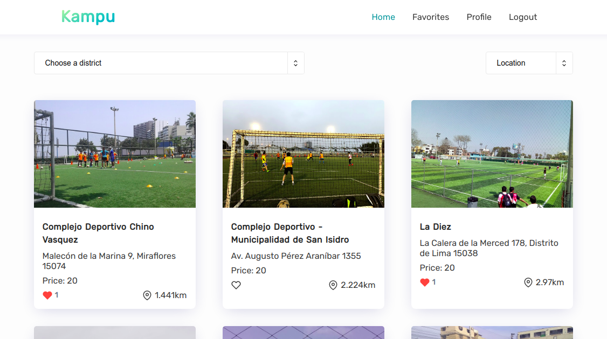

# Kampu

  <h2>An app to book your favorite sports fields</h2>
  

## Setup

The stack in this project is Rails + React.

We have `api` and `client`.

To setup the api:

First use `bundle` to install all the gems for the rails project

    bundle install

Then you should setup the database with

    rails db:setup

And finally, you should run it on a specific port. e.g. `4000`

    rails s -p 4000

To setup the client:

First use `yarn` to install all the package dependencies for the react project

    yarn install

And finally, you should run it, and by default it starts on the port `3000`

    yarn start
